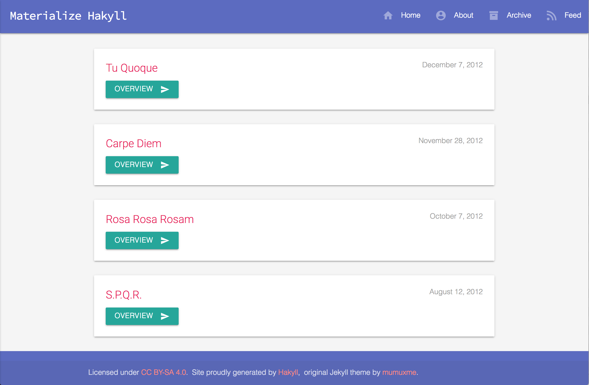
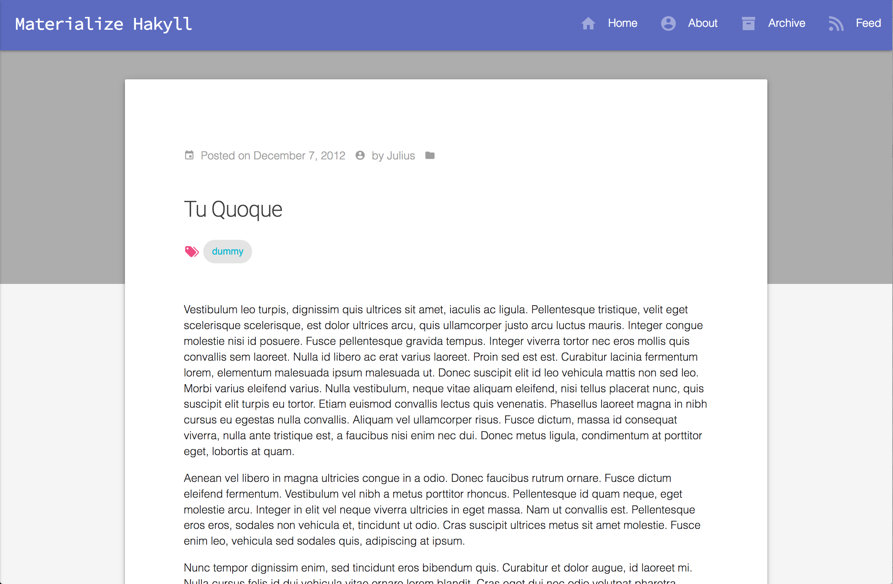

[](https://circleci.com/gh/futtetennismo/materialize-hakyll/tree/source)

# Materialize for Hakyll

This theme is a fork of [materialize-jekyll](https://github.com/mumuxme/materialize-jekyll) originally published by  mumuxme.

## Features
- Material Design
- Responsive layouts
- Support for tags and categories out of the box
- Support for crawl bots out of the box (`sitemap.xml` automatically generated)

## Preview



## Installation
### Create a new website
Make sure you have [`stack`](https://docs.haskellstack.org/en/stable/README/)
installed on your computer. Run `stack build` to compile the website generator
and then `stack exec site rebuild && stac exec site watch` to view your website.

### Apply them to an existing website
Make sure you have [`stack`](https://docs.haskellstack.org/en/stable/README/)
installed on your computer. Copy the files in this repo (you probably don't need
to copy the dummy pages and blog posts) and tweak `site.hs` and any of the other
files as you wish. Run `stack build` to compile the website generator and then
`stack exec site rebuild && stac exec site watch` to view your website.

### Docker
Make sure you have [Docker](https://www.docker.com/) installed. A base docker
image for Hakyll with all needed dependencies installed is available
on [Docker Hub](https://hub.docker.com/r/futtetennista/hakyll/).
To create a docker container for your website run somthing like
`docker run -it -p 8000:8000 -w /home/materialize-hakyll -v $(pwd):/home/materialize-hakyll --name materialize-hakyll futtetennista/hakyll:4.9.8.0`
and then compile the website generator and generate your site inside the newly
created container.

## Usage
### Pages
Add a new page in the `pages` folder.

### Posts

Each blog post **must** have a title and a teaser - read more about teasers in
[this tutorial](https://jaspervdj.be/hakyll/tutorials/using-teasers-in-hakyll.html) -
and can have zero or more tags and an author:

```
---
title: Carpe Diem
tags: dummy, philosophy
---

Fusce tortor quam, egestas in posuere quis, porttitor vel turpis...
<!--more-->
Proin vulputate sapien facilisis leo ornare pulvinar...
```
